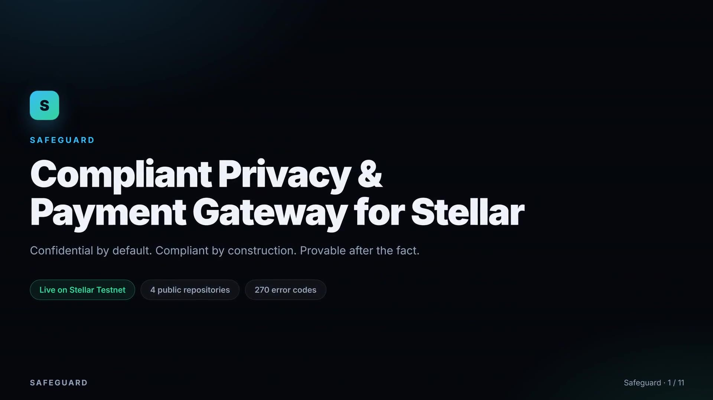
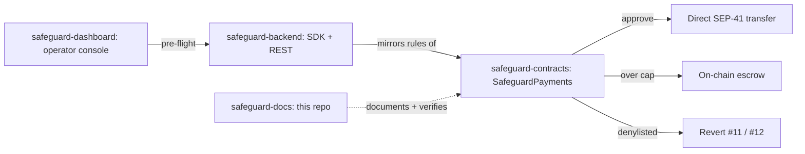

# Safeguard Docs

[](https://github.com/Safeguard-Inc/safeguard-docs/actions/workflows/ci.yml)
[](https://safeguard-docs.vercel.app)
[](tests/engine.test.mjs)
[](https://safeguard-docs.vercel.app/assets/video/safeguard-pitch.mp4)
[](LICENSE)

**The documentation hub for Safeguard: policy-guarded payments on Stellar.**
It explains how the stack fits together, runs the decision engine live in your
browser, and records the Testnet deployment, with every claim checkable
against the chain.

**Live:** **<https://safeguard-docs.vercel.app>**

---

## Table of contents

- [Pitch video](#pitch-video)
- [The Safeguard stack](#the-safeguard-stack)
- [Live Testnet deployment](#live-testnet-deployment)
- [Site map](#site-map)
- [The demo is verifiable, not decorative](#the-demo-is-verifiable-not-decorative)
- [Running locally](#running-locally)
- [How the video is built](#how-the-video-is-built)
- [CI and deployment](#ci-and-deployment)
- [Contributing](#contributing)
- [License](#license)

---

## Pitch video

[](https://safeguard-docs.vercel.app/assets/video/safeguard-pitch.mp4)

Under two minutes (97s), end to end: the problem, the architecture, the decision engine
running in a browser, and the contracts on Testnet. Captions are in
[`assets/video/safeguard-pitch.vtt`](assets/video/safeguard-pitch.vtt).

## The Safeguard stack



| Repository | Role | Question it answers |
| :--- | :--- | :--- |
| [`safeguard-contracts`](https://github.com/Safeguard-Inc/safeguard-contracts) | Define and enforce | What are the rules, and how do tokens move on-chain? |
| [`safeguard-backend`](https://github.com/Safeguard-Inc/safeguard-backend) | Integrate | How does an app check a payment before signing, and decode errors? |
| [`safeguard-dashboard`](https://github.com/Safeguard-Inc/safeguard-dashboard) | Operate | What does an operator see? ([live](https://safeguard-dashboard-mocha.vercel.app)) |
| **`safeguard-docs`** | Explain and verify | How does it fit together, and does it actually work? |

## Live Testnet deployment

Deployed on 2026-10-05. The machine-readable record is
[`data/deployment.json`](data/deployment.json), and the full page is
[`docs/contracts.html`](https://safeguard-docs.vercel.app/docs/contracts.html).

| Component | ID |
| :--- | :--- |
| SafeguardPayments | [`CDC6KVX7QT7CD3GOVGX44NQUNS7FMSZKIAXTV3TDGSXQKJRQMDZRSRCN`](https://stellar.expert/explorer/testnet/contract/CDC6KVX7QT7CD3GOVGX44NQUNS7FMSZKIAXTV3TDGSXQKJRQMDZRSRCN) |
| SafeguardPolicy | [`CCXFDOLLLFZKAG7X6AKN2YLKET5F5X565IHZXPOAGCM7W6MJG5WKANLN`](https://stellar.expert/explorer/testnet/contract/CCXFDOLLLFZKAG7X6AKN2YLKET5F5X565IHZXPOAGCM7W6MJG5WKANLN) |
| Native XLM SAC | `CDLZFC3SYJYDZT7K67VZ75HPJVIEUVNIXF47ZG2FB2RMQQVU2HHGCYSC` |
| Admin | [`GC5MCMHHMFV7GOQ7DVN7MOTMHGTMVIP3YFQAAVFZ6WKUE6SLGQBVODW4`](https://stellar.expert/explorer/testnet/account/GC5MCMHHMFV7GOQ7DVN7MOTMHGTMVIP3YFQAAVFZ6WKUE6SLGQBVODW4) |

| Path | Fee | Proof |
| :--- | ---: | :--- |
| Approved: 50 XLM | 19,237 stroops | [`c762b42f…`](https://stellar.expert/explorer/testnet/tx/c762b42f818387aa584ea33d3da006f22671071ed6e182068994ea6597395e6c) |
| Escrowed: 150 XLM | 739,309 stroops | [`2d832316…`](https://stellar.expert/explorer/testnet/tx/2d83231685f03b17e1a001e6c82c38453459b4f67b416ef60f9be73133026f0e) |
| Escrow released | 16,575 stroops | [`f1257dd8…`](https://stellar.expert/explorer/testnet/tx/f1257dd8e902c4dad2c00b8f71cc98999d9885e402fbd7959c4242202cef2331) |
| Denylisted: blocked | 0 | Rejected at simulation (#11) |

## Site map

| Page / path | What it is |
| :--- | :--- |
| [`index.html`](https://safeguard-docs.vercel.app) | Landing page: the problem, architecture, deployment table, quickstart |
| [`demo.html`](https://safeguard-docs.vercel.app/demo.html) | Interactive policy decision engine running entirely in the browser |
| [`docs/architecture.html`](https://safeguard-docs.vercel.app/docs/architecture.html) | Decision precedence, fail-closed behaviour, error taxonomy |
| [`docs/contracts.html`](https://safeguard-docs.vercel.app/docs/contracts.html) | Deployment record, parameters and on-chain verification |
| [`docs/error-codes.md`](docs/error-codes.md) | Integrator-facing error catalog |
| `assets/engine.js` | JavaScript port of the `safeguard-core` decision engine |
| `data/*.json` | Deployment record, policies and golden decisions used by the tests |
| `video/` | Pipeline that generates the pitch video |

## The demo is verifiable, not decorative

A reference engine on a docs site does harm if it quietly disagrees with the
real one: it teaches the wrong behaviour with confidence. So for every
recorded golden decision, the test suite rebuilds the input and asserts that
the demo's `(decision, reason code, rule id)` matches **exactly**. Every cell
of the account-status and jurisdiction tables is asserted as well.

```bash
npm test
```

```text
✔ golden parity #1: a compliant subject
✔ golden parity #2: a non-member under an allowlist rule
✔ golden parity #3: a sanctions match under a flagging sanctions rule
✔ golden parity #4: a frozen account
✔ golden parity #5: a prohibited jurisdiction
✔ golden parity #6: an unknown jurisdiction
✔ an unrecognized account status fails closed to unknown, never active
✔ precedence: account status outranks every policy rule
...
ℹ pass 24
ℹ fail 0
```

The authoritative implementations are `safeguard-core` and the Soroban
contracts in [`safeguard-contracts`](https://github.com/Safeguard-Inc/safeguard-contracts).

## Running locally

There's no build step. The site is static HTML, CSS and ES modules.

```bash
git clone https://github.com/Safeguard-Inc/safeguard-docs
cd safeguard-docs
npm test          # engine parity suite (Node 20+)
npm run serve     # http://localhost:4173
python3 scripts/check-links.py   # broken link check
```

## How the video is built

The video is generated from this repository, not edited by hand, so it can be
rebuilt whenever the project changes:

| Step | Command | What it does |
| :--- | :--- | :--- |
| 1 | `npm run video:assets` | Renders slides and captures the live demo with Playwright |
| 2 | `npm run video:narrate` | Generates the voice-over from `video/scenes.json` |
| 3 | `npm run video:render` | Assembles the MP4, poster frame and captions |

See [`video/README.md`](video/README.md) for requirements.

## CI and deployment

- **CI** ([`ci.yml`](.github/workflows/ci.yml)): parity tests and the link
  check on every push and pull request.
- **Deploy** ([`deploy.yml`](.github/workflows/deploy.yml)): pushes to `main`
  deploy to Vercel. `vercel.json` sets security headers and caching.

## Contributing

We welcome community contributions: new demo scenarios, more golden-parity cases,
accessibility fixes, and translations.
[Browse open issues](https://github.com/Safeguard-Inc/safeguard-docs/issues) ·
[CONTRIBUTING.md](CONTRIBUTING.md) · [CODE_OF_CONDUCT.md](CODE_OF_CONDUCT.md) ·
[SECURITY.md](SECURITY.md)

## License

Apache-2.0. See [`LICENSE`](LICENSE).
